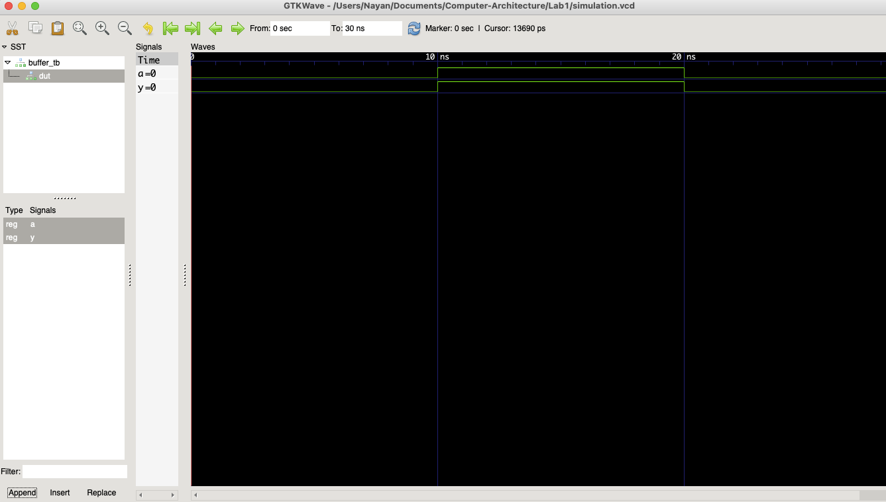

Objective
.To install and configure a VHDL development setup using VS Code, GHDL, and GTKWave.To understand the basic structure of a VHDL program and its components.
.To implement a simple VHDL design, simulate it, and observe the waveform output.

Theory
Overview of VHDL

VHDL (Very High Speed Integrated Circuit Hardware Description Language) is an IEEE-standard language used for describing digital hardware systems. Unlike traditional programming languages, it models hardware behavior where multiple operations occur concurrently rather than sequentially.

It is widely used in digital design for simulation, synthesis, and verification of circuits at different abstraction levels.

Basic Structure of VHDL

A VHDL program mainly consists of three parts:

Library and Package Declarations – Provide predefined data types and functions required for design.
Entity – Defines the external interface of the system, including input and output ports.
Architecture – Describes the internal working or behavior of the entity.
Libraries Used
std library: Provides basic data types such as integers and booleans.
IEEE library: Commonly used in digital design for types like std_logic and std_logic_vector.

Example:

library IEEE;
use IEEE.STD_LOGIC_1164.ALL;
use IEEE.NUMERIC_STD.ALL;
Entity and Architecture

The entity defines how a circuit communicates with the outside world using input and output ports. Ports can be:

in: Input signals
out: Output signals
inout: Bidirectional signals

The architecture defines the internal behavior of the design. VHDL supports different modeling styles:

Behavioral
Dataflow
Structural

In this experiment, the dataflow style is used because it is simple and suitable for basic circuits.

Data Types
std_logic: Represents a single digital signal with multiple logic states.
std_logic_vector: Represents a group of bits (bus).
Signals: Internal connections used inside architecture.
VHDL Design Flow

The development process includes:

Analysis – Checking syntax and compiling code
Elaboration – Connecting design components
Simulation – Running test inputs to verify behavior
Waveform Analysis – Viewing results using GTKWave
Simulation Commands
ghdl -a buffer.vhd buffer_tb.vhd
ghdl -e buffer_tb
ghdl -r buffer_tb --vcd=simulation.vcd
gtkwave simulation.vcd
Design File

The design file implements a simple buffer circuit where the output directly mirrors the input signal. This helps demonstrate the basic structure of a VHDL dataflow model.

Testbench File

The testbench is used only for simulation. It does not have input/output ports. Instead, it generates test inputs (0, 1, 0) at fixed time intervals and connects them to the buffer circuit to verify its behavior.

Simulation File

The .vcd file is automatically generated after simulation. It records all signal changes over time and is used by GTKWave for waveform visualization.

Output

The waveform was observed in GTKWave by loading the generated simulation file. Signals tb_A and tb_Y were added to the waveform viewer.

Observation

The output signal consistently followed the input signal at every time step, confirming correct buffer operation.

Discussion and Conclusion

This experiment successfully introduced the basic workflow of VHDL development using VS Code, GHDL, and GTKWave. A simple buffer circuit was implemented and tested to understand how VHDL code is structured and executed.

The simulation results confirmed that the output accurately replicated the input, validating the correct behavior of the design. This exercise provides a foundation for more complex digital system designs in future labs.