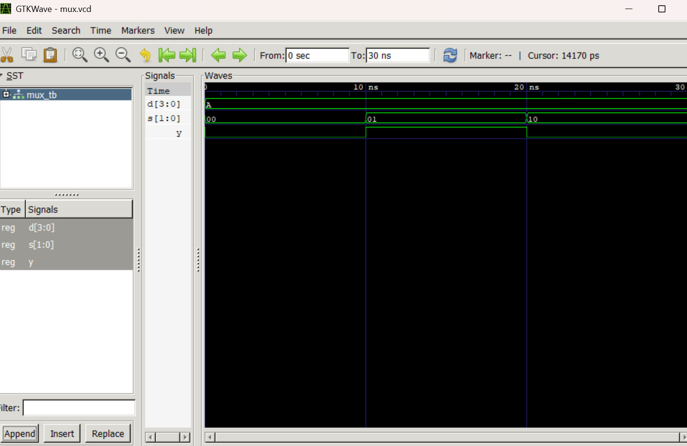
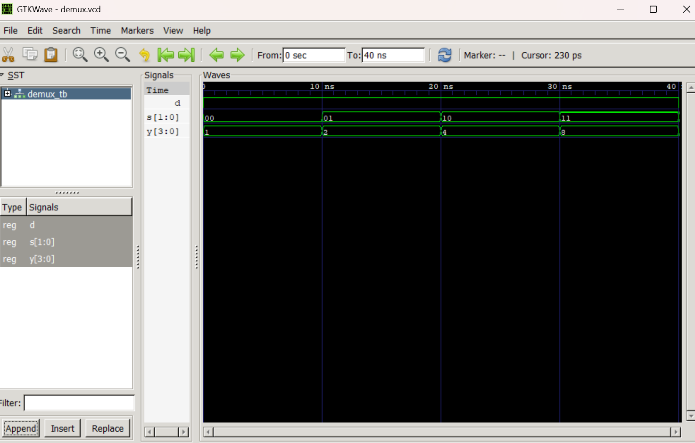

# Lab 4: VHDL Code for Combinational Circuits (MUX and DEMUX)

## Course Information

* **Course:** Computer Architecture (CMP 262)
* **Program:** Bachelor of Computer Engineering
* **Semester:** Fourth Semester
* **College:** Cosmos College of Management and Technology
* **Department:** Information and Communication Technology

---

# Objective

* To design and simulate a 4-to-1 Multiplexer (MUX) in VHDL.
* To design and simulate a 1-to-4 Demultiplexer (DEMUX) in VHDL.
* To understand the working principle of combinational circuits.
* To verify the circuit operation using GHDL and GTKWave.

---

# Introduction

## Combinational Circuits

Combinational circuits are digital circuits whose outputs depend only on the current input values. These circuits do not contain memory elements or feedback paths.

Two important combinational circuits are:

* **Multiplexer (MUX)**
* **Demultiplexer (DEMUX)**

These circuits are widely used in digital systems, communication systems, data routing, and processor design.

---

# Multiplexer (MUX)

A multiplexer selects one of multiple input lines and routes it to a single output line according to the select inputs.

A **4-to-1 Multiplexer** contains:

* 4 data inputs (`D0` to `D3`)
* 2 select lines (`S1S0`)
* 1 output (`Y`)

---

# Truth Table: 4-to-1 MUX

| S1 | S0 | Output Y |
| -- | -- | -------- |
| 0  | 0  | D0       |
| 0  | 1  | D1       |
| 1  | 0  | D2       |
| 1  | 1  | D3       |

---

# Demultiplexer (DEMUX)

A demultiplexer routes one input signal to one of several output lines according to the select inputs.

A **1-to-4 DEMUX** contains:

* 1 data input (`D`)
* 2 select lines (`S1S0`)
* 4 outputs (`Y0` to `Y3`)

---

# Truth Table: 1-to-4 DEMUX

| S1 | S0 | Active Output |
| -- | -- | ------------- |
| 0  | 0  | Y0 = D        |
| 0  | 1  | Y1 = D        |
| 1  | 0  | Y2 = D        |
| 1  | 1  | Y3 = D        |

---

# Libraries Used

```vhdl id="7szd1f"
library IEEE;
use IEEE.STD_LOGIC_1164.ALL;
```

## Description

* `STD_LOGIC_1164` provides the `std_logic` and `std_logic_vector` data types used in VHDL designs.

---

# VHDL Code

# 1. 4-to-1 Multiplexer

## File: `mux_4to1.vhd`

```vhdl id="g82m0k"
library IEEE;
use IEEE.STD_LOGIC_1164.ALL;

entity MUX_4TO1 is
    port (
        D : in std_logic_vector(3 downto 0);
        S : in std_logic_vector(1 downto 0);
        Y : out std_logic
    );
end entity MUX_4TO1;

architecture Behavioral of MUX_4TO1 is
begin

    process(D, S)
    begin

        case S is

            when "00" =>
                Y <= D(0);

            when "01" =>
                Y <= D(1);

            when "10" =>
                Y <= D(2);

            when "11" =>
                Y <= D(3);

            when others =>
                Y <= '0';

        end case;

    end process;

end architecture Behavioral;
```

---

# Testbench: 4-to-1 MUX

## File: `mux_tb.vhd`

```vhdl id="8j0prv"
library IEEE;
use IEEE.STD_LOGIC_1164.ALL;

entity MUX_TB is
end entity MUX_TB;

architecture Simulation of MUX_TB is

    signal D : std_logic_vector(3 downto 0) := "1010";
    signal S : std_logic_vector(1 downto 0) := "00";
    signal Y : std_logic;

begin

    DUT : entity work.MUX_4TO1
        port map (
            D => D,
            S => S,
            Y => Y
        );

    STIMULUS : process
    begin

        -- D = "1010"
        -- D3 = 1, D2 = 0, D1 = 1, D0 = 0

        S <= "00";
        wait for 10 ns;

        S <= "01";
        wait for 10 ns;

        S <= "10";
        wait for 10 ns;

        S <= "11";
        wait for 10 ns;

        wait;

    end process;

end architecture Simulation;
```

---

# 2. 1-to-4 Demultiplexer

## File: `demux_1to4.vhd`

```vhdl id="rj1n7d"
library IEEE;
use IEEE.STD_LOGIC_1164.ALL;

entity DEMUX_1TO4 is
    port (
        D : in std_logic;
        S : in std_logic_vector(1 downto 0);
        Y : out std_logic_vector(3 downto 0)
    );
end entity DEMUX_1TO4;

architecture Behavioral of DEMUX_1TO4 is
begin

    process(D, S)
    begin

        Y <= "0000";

        case S is

            when "00" =>
                Y(0) <= D;

            when "01" =>
                Y(1) <= D;

            when "10" =>
                Y(2) <= D;

            when "11" =>
                Y(3) <= D;

            when others =>
                null;

        end case;

    end process;

end architecture Behavioral;
```

---

# Testbench: 1-to-4 DEMUX

## File: `demux_tb.vhd`

```vhdl id="l2md6a"
library IEEE;
use IEEE.STD_LOGIC_1164.ALL;

entity DEMUX_TB is
end entity DEMUX_TB;

architecture Simulation of DEMUX_TB is

    signal D : std_logic := '1';
    signal S : std_logic_vector(1 downto 0) := "00";
    signal Y : std_logic_vector(3 downto 0);

begin

    DUT : entity work.DEMUX_1TO4
        port map (
            D => D,
            S => S,
            Y => Y
        );

    STIMULUS : process
    begin

        D <= '1';

        S <= "00";
        wait for 10 ns;

        S <= "01";
        wait for 10 ns;

        S <= "10";
        wait for 10 ns;

        S <= "11";
        wait for 10 ns;

        D <= '0';

        S <= "10";
        wait for 10 ns;

        wait;

    end process;

end architecture Simulation;
```

---

# GHDL Simulation Commands

## MUX Simulation

```bash id="cln8yo"
# Compile MUX and testbench
ghdl -a mux_4to1.vhd mux_tb.vhd

# Elaborate testbench
ghdl -e MUX_TB

# Run simulation
ghdl -r MUX_TB --vcd=mux.vcd

# Open waveform viewer
gtkwave mux.vcd
```

---

## DEMUX Simulation

```bash id="3zj3aq"
# Compile DEMUX and testbench
ghdl -a demux_1to4.vhd demux_tb.vhd

# Elaborate testbench
ghdl -e DEMUX_TB

# Run simulation
ghdl -r DEMUX_TB --vcd=demux.vcd

# Open waveform viewer
gtkwave demux.vcd
```

---

# Simulation Output

## Applied Inputs for MUX

| Time  | Select (`S`) | Output (`Y`) |
| ----- | ------------ | ------------ |
| 0 ns  | `"00"`       | `0`          |
| 10 ns | `"01"`       | `1`          |
| 20 ns | `"10"`       | `0`          |
| 30 ns | `"11"`       | `1`          |

---

## Applied Inputs for DEMUX

| Time  | D | Select (`S`) | Output (`Y`) |
| ----- | - | ------------ | ------------ |
| 0 ns  | 1 | `"00"`       | `"0001"`     |
| 10 ns | 1 | `"01"`       | `"0010"`     |
| 20 ns | 1 | `"10"`       | `"0100"`     |
| 30 ns | 1 | `"11"`       | `"1000"`     |
| 40 ns | 0 | `"10"`       | `"0000"`     |

---

# Waveform Output

## MUX Waveform



### Result

The waveform confirms that the selected input is correctly transferred to the output according to the select lines.

---

## DEMUX Waveform



### Result

The waveform confirms that the input signal is correctly routed to the selected output line.

---

# Tools Used

| Tool        | Purpose                                |
| ----------- | -------------------------------------- |
| **VS Code** | Writing and editing VHDL code          |
| **GHDL**    | Compiling and simulating VHDL programs |
| **GTKWave** | Viewing waveform output                |

---

# Conclusion

In this laboratory exercise, a 4-to-1 Multiplexer and a 1-to-4 Demultiplexer were successfully designed and simulated using VHDL. The Behavioral modeling style was used to implement the combinational logic using processes and case statements. The circuits were compiled and simulated using GHDL, and the waveforms were analyzed using GTKWave. The simulation outputs matched the expected truth tables, confirming the correct operation of both the MUX and DEMUX circuits.
